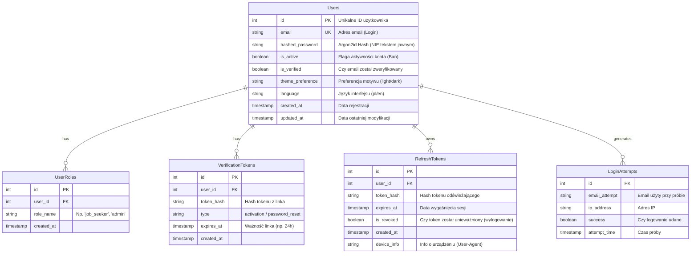

# Auth & Security Schema Design

**Data:** 15.02.2026  
**Status:** Draft (Do akceptacji)

---

## 1. Diagram ERD (Mermaid)

Poniższy diagram przedstawia strukturę bazy danych odpowiedzialną wyłącznie za tożsamość użytkownika, jego profil oraz bezpieczeństwo sesji.



---

## 2. Zabezpieczenia (Security Implementation)

### 2.1. Przechowywanie Haseł
*   **Algorytm:** **Argon2id** (obecny standard branżowy, odporniejszy na ataki GPU niż bcrypt).
*   **Sól (Salt):** Generowana automatycznie i unikalna dla każdego użytkownika.
*   **Polityka:** Baza danych NIGDY nie widzi hasła w formie jawnej.

### 2.2. Ochrona Sesji (JWT + Refresh Token)
*   **Storage Strategy:** **HttpOnly Cookies** (Dla obu tokenów).
    *   Ciasteczka są niewidoczne dla JavaScript (ochrona przed XSS).
    *   Wymagają flag `Secure` (HTTPS) i `SameSite=Strict`.
*   **Access Token (JWT):** Krótki czas życia (np. 15 minut). Przechowywany w ciasteczku `access_token`.
*   **Refresh Token:** Długi czas życia (np. 7 dni). Przechowywany w ciasteczku `refresh_token`.
*   **Tabela `RefreshTokens`:** Pozwala na "zdalne wylogowanie" wszystkich urządzeń poprzez zmianę flagi `is_revoked`.

### 2.3. Ochrona przed atakami
*   **SQL Injection:** Użycie **SQLAlchemy ORM**, który automatycznie escapuje zapytania.
*   **Brute Force:** Tabela `LoginAttempts` pozwala na blokowanie IP po X nieudanych próbach w ciągu Y minut (Rate Limiting).
*   **Account Takeover:** Przy zmianie hasła unieważniane są wszystkie aktywne tokeny sesyjne (`RefreshTokens`).

### 2.4. Usuwanie Konta (GDPR/RODO)
*   **Procedura:** Usunięcie konta jest operacją **trwałą (Hard Delete)**.
*   **Kaskadowość:** Usunięcie rekordu z `Users` automatycznie usuwa powiązane `UserRoles`, `RefreshTokens`, oraz dane osobowe.
*   **Logi:** W logach systemowych pozostaje jedynie ślad o usunięciu ID (bez danych osobowych).

### 2.5. Infrastruktura Email (SMTP)
*   **Cel:** Weryfikacja email przy rejestracji, Reset hasła.
*   **Rozwiązanie:** Zewnętrzny dostawca Transactional Email (np. **Resend** lub **SendGrid**) dla wysokiej dostarczalności.
*   **Konfiguracja:** Dane SMTP trzymane w zmiennych środowiskowych (`.env`) na serwerze, nigdy w kodzie.
*   **Flow:** Backend kolejkuje zadania wysyłki (Background Tasks), aby nie blokować API.

--- -- Ban / Soft Delete
is_verified BOOLEAN DEFAULT FALSE, -- Email Confirmed
    
## 3. Definicje SQL (Implementacja)

```sql
-- 1. Użytkownicy
CREATE TABLE users (
    id SERIAL PRIMARY KEY,
    email VARCHAR(255) UNIQUE NOT NULL,
    hashed_password VARCHAR(255) NOT NULL, -- Argon2id hash
    is_active BOOLEAN DEFAULT TRUE,
    theme_preference VARCHAR(10) DEFAULT 'dark',
    language VARCHAR(5) DEFAULT 'pl',
    created_at TIMESTAMP WITH TIME ZONE DEFAULT NOW(),
    updated_at TIMESTAMP WITH TIME ZONE DEFAULT NOW()
);
. Tokeny Weryfikacyjne (Email & Password Reset)
CREATE TABLE verification_tokens (
    id SERIAL PRIMARY KEY,
    user_id INTEGER REFERENCES users(id) ON DELETE CASCADE,
    token_hash VARCHAR(255) NOT NULL, -- Hashujemy token, tak jak hasło
    type VARCHAR(20) NOT NULL, -- 'activation', 'password_reset'
    expires_at TIMESTAMP WITH TIME ZONE NOT NULL,
    created_at TIMESTAMP WITH TIME ZONE DEFAULT NOW()
);

-- 3. Role (RBAC)
CREATE TABLE user_roles (
    id SERIAL PRIMARY KEY,
    user_id INTEGER REFERENCES users(id) ON DELETE CASCADE,
    role_name VARCHAR(50) NOT NULL,
    created_at TIMESTAMP WITH TIME ZONE DEFAULT NOW(),
    UNIQUE(user_id, role_name)
);

-- 4. Sesje (Bezpieczeństwo)
CREATE TABLE refresh_tokens (
    id SERIAL PRIMARY KEY,
    user_id INTEGER REFERENCES users(id) ON DELETE CASCADE,
    token_hash VARCHAR(255) NOT NULL, -- Hash tokenu, nie sam token
    expires_at TIMESTAMP WITH TIME ZONE NOT NULL,
    is_revoked BOOLEAN DEFAULT FALSE,
    device_info VARCHAR(255),
    created_at TIMESTAMP WITH TIME ZONE DEFAULT NOW()
);

-- 5. Rate Limiting (Brute Force Protection)
CREATE TABLE login_attempts (
    id SERIAL PRIMARY KEY,
    email_attempt VARCHAR(255),
    ip_address VARCHAR(45), -- IPv6 support
    success BOOLEAN DEFAULT FALSE,
    attempt_time TIMESTAMP WITH TIME ZONE DEFAULT NOW()
);
CREATE INDEX idx_login_attempts_ip ON login_attempts(ip_address, attempt_time);
```

---

## 4. Flow Weryfikacji (Jak to działa?)

### Dlaczego `VerificationToken`?
Jest to bezpieczny sposób na sprawdzenie, czy użytkownik ma dostęp do skrzynki email, bez trzymania "klucza" w bazie danych w formie jawnej.

### Krok 1: Rejestracja
1. Użytkownik podaje email: `jan@example.com`.
2. System tworzy konto z `is_verified = FALSE`.
3. System generuje losowy, długi token (np. `abc123xyz...`).
4. **W bazie zapisujemy TYLKO HASH tego tokenu** (nieodwracalny skrót).
5. Oryginalny token wysyłamy na maila w linku: `jhunt.pl/verify?token=abc123xyz...`.

### Krok 2: Kliknięcie w link
1. Użytkownik klika w link.
2. Frontend wysyła token `abc123xyz...` do API.
3. Backend liczy hash otrzymanego tokenu.
4. Backend szuka w tabeli `verification_tokens` rekordu, gdzie hash się zgadza.
   - **Jeśli pasuje i nie wygasł:** Ustawia `is_verified = TRUE` i usuwa zużyty token.
   - **Jeśli nie pasuje:** Błąd (link nieprawidłowy).

### Bezpieczeństwo
Gdyby haker wykradł bazę danych, zobaczy tylko hashe tokenów. Nie jest w stanie odtworzyć oryginalnych tokenów, więc **nie może przejąć kont ani aktywować ich za użytkowników**.
